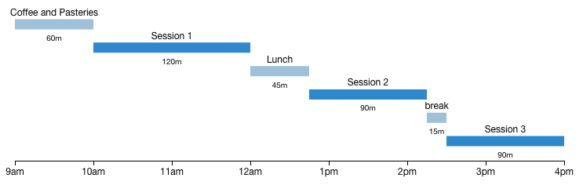

# d3.js for coders and analysts: intro

## Schedule

## Session 1 (2h)
+ Intro
+ Demos / getting excited
+ SVG Overview (The DOM is a Scenegraph)
+ Intro to D3: Lets change the DOM
+ Selectors
+ Transitions and animation

## Session 2 (1.5h)
+ Setup a server, loading data
+ Data binding (Enter / update / exit)
+ Scales (are useful when you have data)

## Session 3 (1.5h)
+ Interactions
+ Layouts as data transformations
  + Treemaps
  + Force layouts
  + Nesting
  + Histograms

## Questions
 + Have you ever used a debugger?
 + Do you know what a callback is?
 + Have you ever written code in a language where a function was also an object?
 + Do you know the difference between a vector image and a bitmap?
 + Do you know what a HTTP GET request is?

To run this project locally run:

    npm install

Then

    node server.js

To fire up the server. Now, pull up `http://localhost:3000` in your browser and you should be gtg!

NOTE: that when running the project locally, any changes to the examples will be saved to the examples directory.